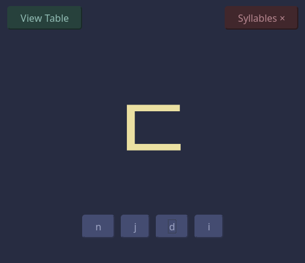

# hangul
A korean alphabet quiz located [here](https://sedlar.me/korean/hangul)

Makes use of my microframework [eltag](https://github.com/TSedlar/eltag)

Many thanks to [wikipedia](https://en.wikipedia.org/wiki/Hangul) for their data collection that was parsed for this project.
